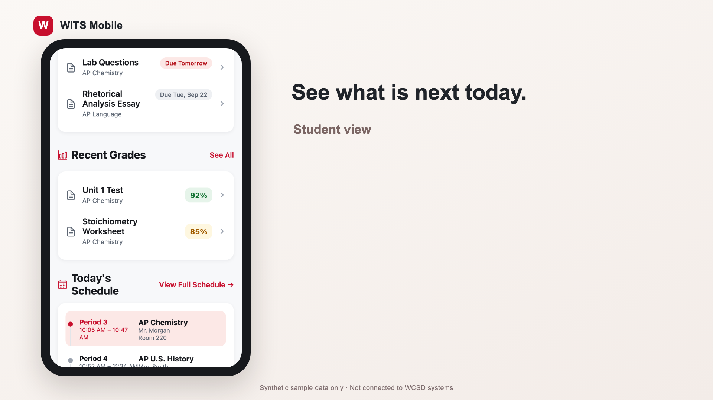
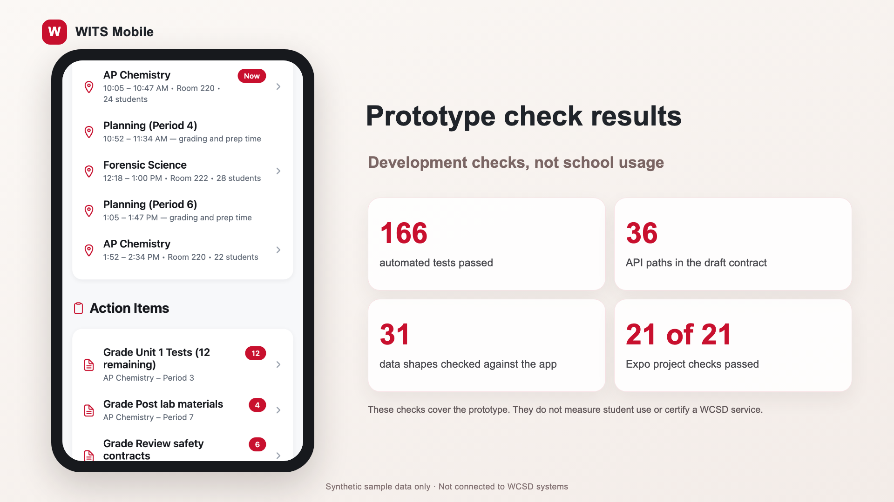

# WITS Mobile

WITS Mobile is a school portal prototype created with Williamsville Central School District in mind.

Students can check the day ahead. Parents can follow updates tied to each child. Teachers can review class details. Schedules, courses, grades, assignments, attendance, messages, events, resources appear in one app.

## What is inside

Every name, grade, schedule, attendance record, message, event in this project is invented. The app is not connected to WCSD systems. It contains no real student records. It does not collect school passwords.

The prototype has separate home screens serving students, parents, teachers. It supports iOS phones, Android phones, web browsers. The sample screens show daily tasks with data made only to demonstrate the experience.

## How the app works

Each screen gets school information through the same part of the app. The sample source feeds invented records. A district connection can reach a school service after WCSD approves it. The app checks the information format before showing it.

The district service must confirm who signed in. It must decide which records that person may see. A screen choice alone cannot protect school records.

Native sign in uses the device browser with a one time code exchange. The app keeps sign in tokens in secure device storage. WCSD has not provided a test identity service. Real sign in remains unverified. Browser sign in needs a district service that can create a secure session.

## Try the prototype

Install the project tools with `pnpm install`. Start the app with `pnpm start`. Choose a phone preview in Expo. The sample sign in is marked in the app.

Run `pnpm test` to check app behavior. Run `pnpm typecheck` to check data shapes. The setup notes in `.env.example` show the values needed to point a development build at an approved test service.

## What a WCSD connection needs

WCSD must provide a test service, test accounts, sign in settings, approved data permissions. The service must protect each student record on every request. District API keys, client secrets belong on that service. They must never be placed in app build settings.

The current API description explains what the app expects. It does not create a district backend. Real student information must wait until WCSD approves the service, privacy review, security review.

## Project guides

[Privacy overview](docs/PRIVACY.md)

[Security overview](SECURITY.md)

More project notes appear in the `docs` folder.

## Checks completed

The current development check covers automated tests, information format checks, agreement with the written service plan, requests to the sample server. These checks do not prove that a WCSD service is secure. They do not replace tests on iPhone devices. Android devices need their own review.

## See the prototype

[Watch the WITS Mobile tour](media/out/witsmobiletour.mp4)
